```{r options, echo=FALSE, error=FALSE, warning=FALSE, message=FALSE}

library(knitr)

opts_chunk$set(echo = FALSE, error = FALSE, warning = FALSE, messages = FALSE, cache = TRUE)


```


```{r load-libraries, echo=FALSE, error=FALSE, warning=FALSE, message=FALSE}

library(knitr)

opts_chunk$set(echo = FALSE, error = FALSE, warning = FALSE, messages = FALSE, cache = TRUE)

# load libraries


library(readxl)
library(writexl) 
library(ggplot2) 
library(tibble) 
library(tidyr) 
library(readr) 
library(purrr) 
library(dplyr) 
library(stringr) 
library(forcats) 
library(lubridate) 
library(janitor) 
library(scales) 
library(ggtext) 
library(paletteer) 
library(viridis) 
library(RColorBrewer)
library(wesanderson) 
library(dutchmasters) 
library(gghighlight)
library(monochromeR)
library(ggforce)
library(kableExtra)


```

\Large

::: {.callout-tip appearance="minimal"}

"My aim here is to contribute something to the improvement of learning in our school district; or any school district.  My goal is to build a collabrative community in the education domain helping each other find better and better ways of using data to guide, improve and govern their systems of learning.   

I look forward to the day when everyone at every level is comfortable sketching a simple flow diagram, trying some changes, and plotting the results to see if the changes worked.  This straightforward process makes possible and encourages the study of different methods of learning and administration (inputs) and their impact on the results observed (outputs) ***at the local level.***  Those interested in using data to help improve learning in their district please feel free to contact me."
\bigskip

<div style="text-align: right;">-- Dan Swart</div>
 
:::

<br>
\vspace{0.3in}

# **INTRODUCTION**

Everyone at every level in a school district is trying to answer important, practical questions and seek data to help them.   Those questions include:

*  The numbers vary from time period to time period.  **Does that variation signal anything important?**

*  Is the variation I see due to normal **random fluctuations** that are present in all measurements, or to some strong influence(s) now present in the system?

*  Do the varying numbers **constitute a trend** (good, or bad)?

*  What is the **demonstrated output capability** of our district to deliver STAAR scores (or any other results) in the various categories and levels?  In other words, what is **rational** to expect from our system **in the future?**

*  **Should we continue** a particular approach, **abandon** it, or **continue it with modification?**  

* Should we change something right away with an intervention, **or will that make things worse?**

* Under current leadership, are we improving, staying the same, or getting worse, and **how can we tell?**

<br>


***If you are a board member, district employee, or concerned citizen who asks themselves questions like these, this paper can help you.  If you find little value in changing how you use data as a guide for action, this paper is definitely not for you.***

<br>

This paper is for anyone striving to improve learning in their school district and who think data can help them.  Anyone can use the simple theory and techniques to significantly improve their teaching, classrooms, campuses, departments and districts.  


To improve our systems of learning in a rational, systematic way we need new information beyond that supplied by merely 'description-only' reports.  Only a few simple changes are required.  


Currently, neither the Texas Education Agency (TEA) nor the Texas Association of School Boards (TASB) offer training or support in the appropriate methods and tools that would give school boards and administrators access to the new information they need.


I predict that educators who learn to draw a very simple flow diagram and very simple charts can (and will) improve any results they wish to improve.  These simple tools allow anyone to examine how the inputs of a learning process may (or may not) affect the outputs of the process.  Although they are prettier coming from a computer, they can, quite literally, be constructed with a piece of newsprint and a crayon.


Thus, anyone can experiment on a small scale and evaluate the results before attempting large scale changes.  Those results are easily shared with others, such as school boards and administrators, and form a rational basis for understanding the results observed and any proposed changes.


All that is required is an open mind, willingness to do things a little differently, and a sense of urgency for getting things done.  That sounds like Texans, to me.


\vspace{0.3in}
<br>


# **BACKGROUND**


All school boards and superintendents work very hard to 'keep the lights on' and improve learning in their districts and campuses (or 'campi' if you prefer the Latin form, because it ***is*** funnier).  


Administration of budgets for facilities, equipment, personnel, safety and legislative compliance is a function of the managerial skill of the executive team and the school board.  It is usually well managed with thoughtful planning and careful attention to fiscal details.  Both TEA and TASB supply quality education and support for the budgeting element of school board responsibility.


Improving learning in a district is a very different challenge and requires a different set of skills and knowledge.  


Currently, there are dozens of situations where we need better ways to evaluate our data.  


```{r, echo=FALSE,   results='asis'}

# HTML output

column1 = c("STAAR scores", "District improvement plans", "Dropout rates", "On-time arrivals for buses", "Superintendent evaluations", "Superintendent searches")

column2 = c("Survey results", "TAPR reports", "Pedagogy review", "Attendance rates", "Graduation rates", "Accountability ratings" )
example_metrics_table <- data.frame(column1, column2)

# Create a table

knitr::kable(example_metrics_table, "simple", col.names = c("Example Metric", "Example Metric"), booktabs = TRUE, caption = "<span style='font-size: 16pt;'>**Here are just a few examples of data that come our way:**</span>") %>% 

# Use kableExtra to add formatting

  kable_styling(bootstrap_options = c("bordered")) %>%
  add_header_above(c(" " = 1, " " = 1)) %>%
  column_spec(1, width = "3.75in") %>%
  column_spec(2, width = "2.5in")


```


To make better decisions, the ***'description-only'*** reports we currently use to evaluate the performance of programs, pedagogy, people, or anything else must come to us in a slightly different format than what we are used to seeing.  


Any evaluation of results must go beyond what is included in 'snapshot' reports, or even reports with two-point or three-point comparisons.  As discussed later, trends cannot be established with only two or three data points.


As it turns out, the "new" information we need is already there in our data, but it is 'hidden'.  As long as we continue to use and rely on ***'description-only'*** reports this critical information ***will remain hidden from us.***


The following report is called an ***Individuals Chart (part of an XmR chart pair)***[^1] [^2] and it is an example of what a report looks like that includes the information necessary to create well-codified reports, charts, and documents that are concise and reliable.  This chart analyzes public STAAR data provided by TEA, and includes a brief interpretation of the chart.  The XmR chart provides a baseline (context) for evaluating both past and future performance.


[^1]: The chart shown is the 'Individuals' chart.  A complete XmR chart presentation also includes the 'Moving Range' chart that plots the size of the up-and-down movement between data points.  The Moving Range chart is used to calculate the range of values that is considered 'normal' for the process (i.e., the 'common cause' variation present in the process).
<br>

[^2]:  The 'XmR' chart is one of a family of 'control charts' invented and developed by Walter A. Shewhart in 1929 while an engineer at Bell Telephone Laboratories.   They are still the gold standard tool for understanding a process by separating 'common cause' variation from 'special cause' variation.  The XmR chart is the "voice of the process" and reveals if your process is stable (predictable) or subject to a strong influence that makes it unpredictable.

<br>

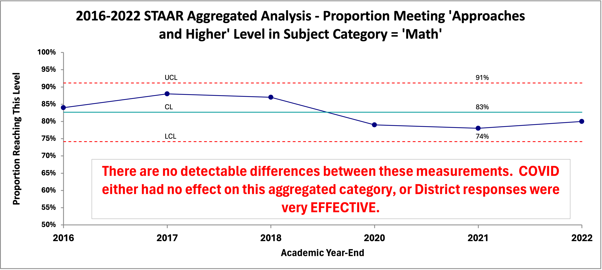
Fig:  Data taken from 5 TEA "Snapshot" description-only reports and 1 TAPR description-only report

<br>
\vspace{0.3in}

## INTERPRETING THE CHART[^3]  

[^3]: Since interpretation of the chart concerns ***future*** results expected of the process, the chart represents evidence that should influence our degree of belief in what the future holds.  Since the future is uncertain, there is always some probability that our expectation will be wrong.  Additional data helps a lot to reduce the uncertainty but will never eliminate it. 


* The measurements (the outputs) do go up and down, but ***there is no numerical evidence that the movements are more than random variation***.  The ups and downs are almost certainly due to the many random forces acting on the cause system that produced the results (the inputs).  This is called ***common cause variation*** because the forces acting on the system are common to all the results we see.


* In this case, the chart shows that all measurements fall between the calculated Upper Limit (UCL) and Lower Limit (LCL), with no statistical trends[^4] identified.  Accordingly, the process is ***stable***, with a ***predictable output capability***.  Of the many forces influencing the results, no one of them is predominant.  If one force (or a small combination of forces) was predominate the chart would reveal it.


[^4]: Statistical techniques to detect 'trends' exist and require 7 or more data points to detect.  A special 'trend' occurs when a point falls outside the range of 'normal' variation.  This is called a 'special' cause of variation.  The rules to detect these trends are easily learned and are built in to software that specializes in control chart preparation.


* If the process remains fundamentally the same, **the proportion of students in the district taking the STAAR exam in Math that reach the level of 'Approaches Grade Level Standard, or Higher' will continue to fluctuate between 91% and 74%, with an average proportion of 81% (the CL)**.  


* Given the data in the chart, any expectation of results outside those limits, without a significant change to the system, ***would not be justified - at all*** (even if that expectation comes from the legislature and the TEA in the form of revised scoring criteria).


* Any future result, if it falls inside the calculated boundaries ***does not signify an increase or decrease in the performance of the process.***  Understanding this rule prevents 'over-reacting' to random fluctuations.  Every 'up' or 'down' does not mean we are doing better, or worse.


* Confidence in the interpretation will **increase** as you add more data to the chart.  For example, it would be helpful to add years prior to 2016 to see if our interpretation of the data changed.


* This one chart includes all the information this data can reveal.  ***If you need or want more information you have to collect more data***.

<br>

::: {.callout-important}

<span style="font-size: 1.2em;">***With this one simple chart*** we are in a position to address each of the practical, important questions outlined earlier, at least for this particular STAAR category and level.  Why would you settle for less?  No other report even comes close.</span>

:::

<br>

::: {.callout-tip}
## Interesting Observation:  

<span style="font-size: 1.2em;">Following the COVID pandemic we all heard about the loss-of-learning "crises" in schools.  I wanted to see if such a "crises" could be detected using quantitative methods; not just personal opinion.  The quantitative evidence of the XmR chart indicates that even the extreme government measures imposed during the COVID-19 pandemic apparently were not disruptive enough to the district to create even a single point outside the "normal" limits.  Or, the counter-measures employed by the district were very effective.</span>

:::

<br>
\vspace{0.3in}

# **WHAT'S WRONG WITH THE 'DESCRIPTION-ONLY' REPORTS WE USE NOW?**


The aim of a TEA report is 'description-only'.  ***How many or how much.***  They are estimates of how many people belong to this or that category for a specified academic year.  Or, to report the financial aspects of operations during the school year.  Their aim is **NOT** to find out **WHY** there are so many or so few in this or that category: merely how many.  


The action to be taken is on the district, campus, or people studied.  It is a process designed for handing out reward and punishment.


On the other hand, school boards want to ***improve learning in the future.***  


Interest centers on future learning, not the learning of the past.   For example: adopt Policy B over A, or hold on to Policy A, or try Policy C on a small scale (with further study).


The TEA collects data from every school in Texas, performs a multitude of calculations, and produces reams of ***'description-only'*** reports and tables summarizing their results by academic year.  These ***'description-only'*** reports consist primarily of calculations mandated by the state legislature, including those designed to allow districts to fulfill their public notification requirements.  


These statistical summaries are available to the public and the school districts.  Unfortunately, for the public and the school districts, the information is not nearly as helpful as it could be.  In fact, it takes so much 'data wrangling' to put it into a form that is remotely helpful for assessing and improving district and campus learning that it is simply not done.


Instead, administrators and school boards stare at endless rows and columns of mind-numbing data fragments that are 'sliced and diced' to an extent that even [\textcolor{blue}{\url{Ron  Popeil}}](https://en.wikipedia.org/wiki/Ron_Popeil) <a href="https://en.wikipedia.org/wiki/Ron_Popeil" target="_blank">the inventor of the Chop-O-Matic</a> would be envious!


After earnestly pouring over such ***'description-only'*** reports users  still have no rational basis to predict what results to expect in the future.

<br>
  
Here's a partial example from a ***'description-only'*** TEA report called a 'Snapshot':
<br>


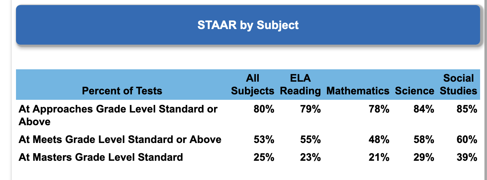
Fig:  Small sample from TEAs Snapshot descrption-only  report


The entire report can be found here:  
[\textcolor{blue}{\url{PDF Link}}](https://rptsvr1.tea.texas.gov/cgi/sas/broker?_service=marykay&_program=perfrept.perfmast.sas&_debug=0&ccyy=2022&lev=D&id=094902&prgopt=reports%2Fsnapshot%2Fsnapshot.sas) 


<a href="https://rptsvr1.tea.texas.gov/cgi/sas/broker?_service=marykay&_program=perfrept.perfmast.sas&_debug=0&ccyy=2022&lev=D&id=094902&prgopt=reports%2Fsnapshot%2Fsnapshot.sas" target="_blank">(HTML Link)</a>


<br>
And, here's a partial example from a TEA ***'description-only'*** report called a 'School Report Card':

<br>


Fig:  Small sample from TEAs School Report Card description-only report


<br>


The entire report can be found here:  
[\textcolor{blue}{\url{PDF Link}}](https://rptsvr1.tea.texas.gov/cgi/sas/broker?_service=marykay&_program=perfrept.perfmast.sas&_debug=0&ccyy=2022&lev=C&prgopt=reports/src/src.sas&id=094902003) 


<a href="https://rptsvr1.tea.texas.gov/cgi/sas/broker?_service=marykay&_program=perfrept.perfmast.sas&_debug=0&ccyy=2022&lev=C&prgopt=reports/src/src.sas&id=094902003" target="_blank">(HTML Link)</a>


<br>
\vspace{0.3in}

# **OBSTACLES TO IMPROVEMENT** 
  
So, what is a school district to make of all these mountains of numbers grouped and mixed together?  Do they help districts improve learning in the future?  In their present form, the answer is definitely "NO!"  
<br>


## **OBSTACLE #1**

When it comes to improving the system of education in a district this 'snapshot' view of the data has several very important limitations.  One is the grouping of several categories that probably represent different processes into one group.  Some TEA ***'description-only'*** reports combine more than one rating level into a single reporting level.  This assumes that the process that produced the results in one category produces the results in them all.


For instance, one combines the 'Approaches Grade Level' AND the 'Meets Grade Level' AND the 'Masters Grade Level' ratings all into one combined group total and calls it the "Approaches Grade Level Standard AND HIGHER" level.


To make that category useful for improvement efforts we have to break it into the three separate levels, so each represents a single situation (process).  Currently, that turns out to be quite tedious and extremely time-consuming.


The 'Snapshot' ***'description-only'*** report offered by the TEA is a good example.  My hat is off to their programmers.  It is an impressive compilation of statistics all in one place.  It is well-suited for the needs of the TEA and their reporting responsibilities to the legislature; but completely ill-suited for helping the concerned school board, superintendent, or even tax-paying citizen make an analysis aimed at improving future learning.  One might call it a triumph of computation over value.  
<br>


Although this grouping of categories permits TEA to render abstract judgments about a district or campus, the lack of specificity renders these ***'description-only'*** reports unsuitable for understanding any particular process, category or level your board may be interested in monitoring or improving.  (Be mindful that this is not TEA's fault; they must follow the direction of the legislative intent.)
<br>
<br>


::: {.callout-tip}
##  <span style="font-size: 1.2em; color: forestgreen">It's like...</span>

<span style="font-size: 1.2em;">trying to repair your car by reading the overall repair records of similar models.  What you need is diagnostic data about what is happening (or not happening) with your ***specific</b> vehicle.***</span>

:::

<br>
\vspace{0.3in}

Here is an example of several STAAR categories grouped together in a TEA ***'description-only'*** report:  


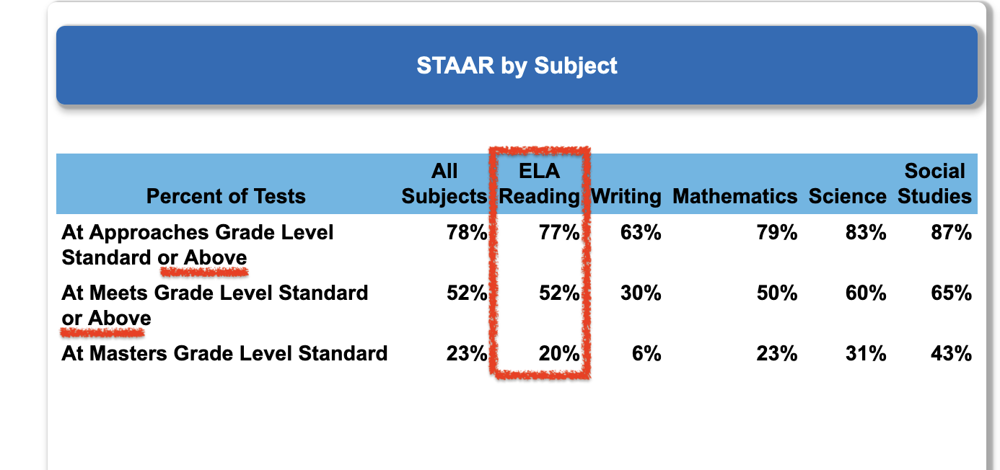

Fig:  The first two rows combine more than one achievement level

<br>
Here's the section reporting STAAR scoring by ethnicity:

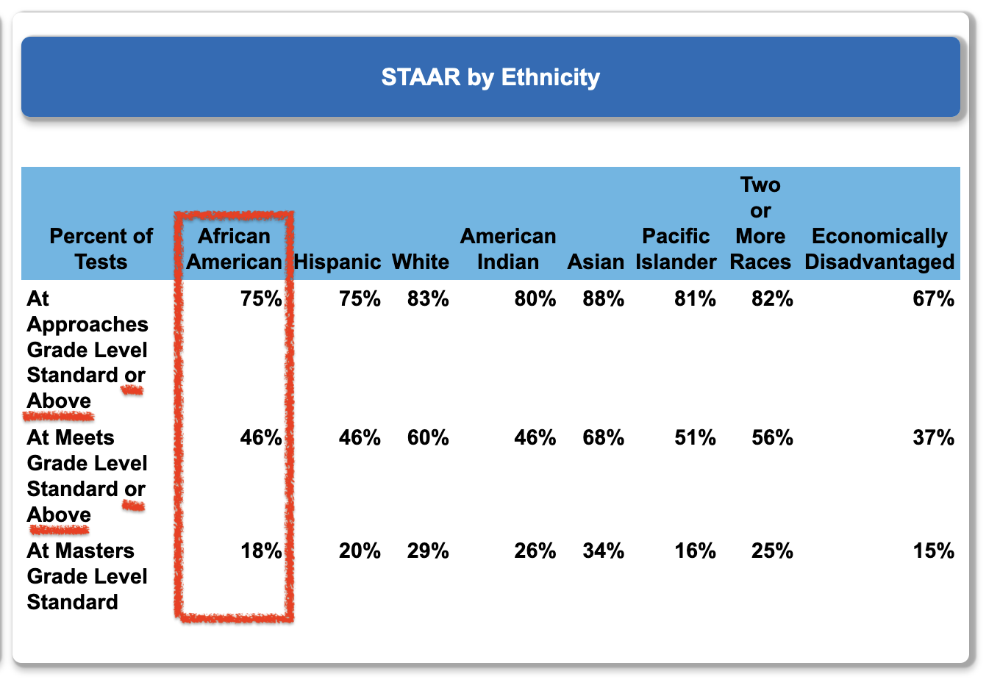

Fig:  The first two rows combine more than one achievement level

<br>
\vspace{0.3in}

## **OBSTACLE #2**


These ***'description-only'*** reports are 'ill-suited' for district improvement efforts for another reason:  the TEA 'description-only' reports are **siloed by academic year**, making it nearly impossible to create a time-period-by-time-period data frame of any categories or levels the board may wish to analyze.  In fact, without time-period-by-time-period data ***no meaningful analysis is possible.***


This siloing of academic years stands as a bristling obstruction to the analysis of past performance and estimation of future results.  Even the least experienced board members intuitively know the importance of numerical context when reviewing data for their district.  


<br>

::: {.callout-note}

It was our innate need for context that created the "this-month vs this-month-last-year vs year-to-date" presentations so popular today.  "This vs that" presentations are two-point comparisons that waste more resources than all our unnecessary meetings put together.

:::

<br>
\vspace{0.3in}

## **OBSTACLE #3**
<br>

::: {.callout-tip appearance="minimal"}

  <p><strong>"At sea one day you will smell land where there be no land."</strong></p>
  \bigskip
  <p class="quote-author">          —  Elijah, to Ishmael and Queequeg</p>
  <p class="quote-description">  _Moby Dick (film, 1956)_</p>
</blockquote>

:::


<br>
\vspace{0.3in}

Obstacle number 3 is not related to the TEA 'description-only' reports at all.  It has to do with our human nature (or, as Jessica Rabbit put it in the 1988 film 'Who Framed Roger Rabbit':  "I'm not bad, I'm just drawn this way!").


For survival, humans evolved with the ability to rapidly detect patterns.  That instinct can lead us astray when studying our data.  Unfortunately, we quite naturally see 'trends' and 'signals' where there are none.  


Consider that for any three measurements there are at least 10 completely random arrangements that can arise.  And, we have created names to categorize these completely artificial 'trends' that we think we see:


<br>

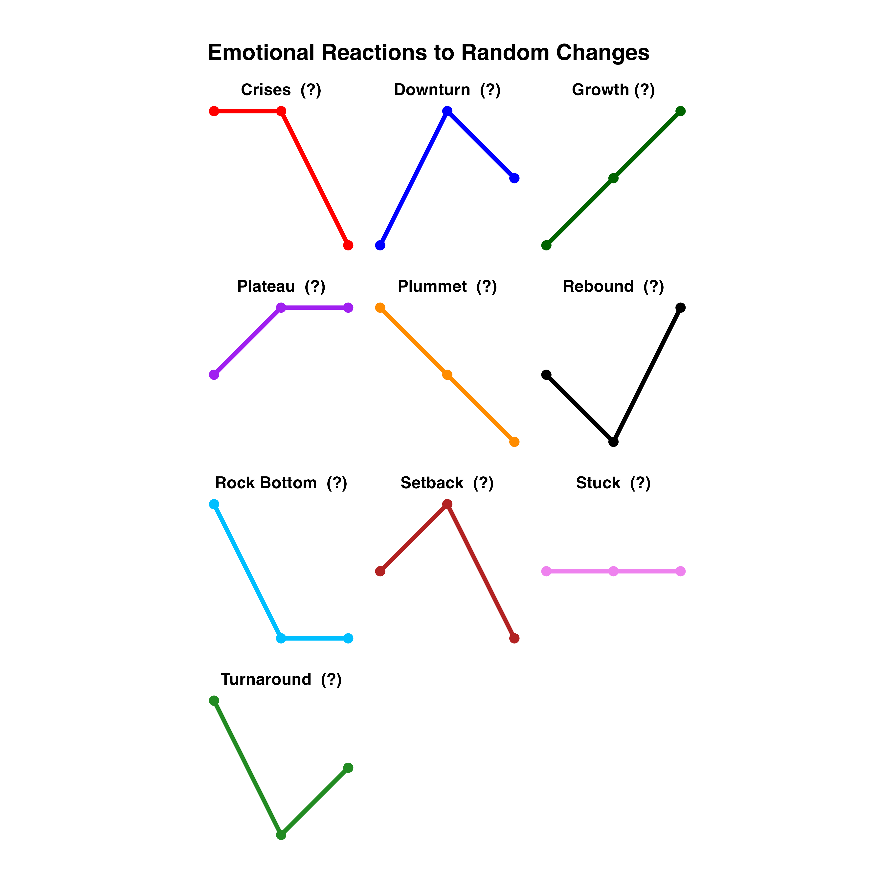

Fig:  Ten random arrangements of 3 measurements

<br>
\vspace{0.3in}


How many of those 'trends' do you see in this example of TEA data placed on a bar chart?


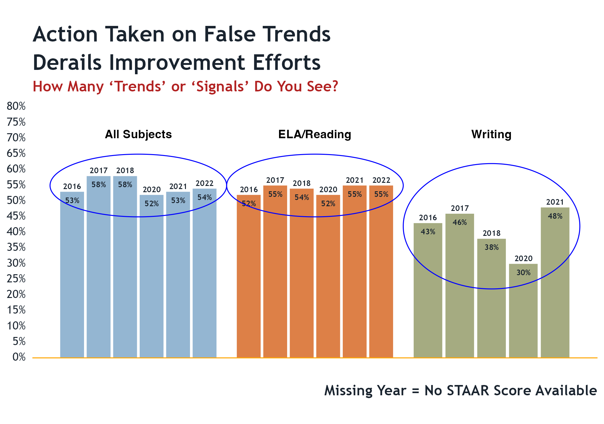

Fig:  Do you see any trends or signals in the bars?


<br>
\vspace{0.3in}

So, ***we need a report that can separate the 'common cause' variation (routine variation) from the 'special cause' variation that signals a true trend, or a detectable event that changes the system.***  


Our current ***'description-only'*** reports do not make that separation for us.

<br>
\vspace{0.3in}

***The XmR chart does.***


<br>
\vspace{0.3in}
 

## **OBSTACLE #4**

 
Obstacle #3 is about our perceptions.  Obstacle #4 is about our emotions.  We have a very human impulse to intervene any time we feel something is 'wrong' and needs to be 'fixed.'  The incentives for board members to seek interventions are many and varied, but it is the type of change proposed that really matters.  


This is also a situation where board members must remain vigilant about getting involved in matters that are administrative (the responsibility of the superintendent) and not district policy (the responsibility of the board).


A problem arises if we react to a result that is merely random ('common-cause'  variation) as if it were a 'special cause' signal.  This is called 'tampering' and is ***guaranteed to make things worse.***  The variation we observe will increase and our good results will be diluted accordingly.  At worst, we can de-stabilize a stable system that people have worked hard to develop.  


This can be particularly acute when there is an incident involving misfortune or safety.  Although rare, these events may be quite distracting and upsetting.  However, trying to keep unpleasant events from 'ever happening again' is impossible and can make things worse, not better.


It is part of the leadership responsibility of boards to provide a measured and rational response when misfortune comes our way.  Knowing about 'common cause' and 'special cause' variation can help us do that. 

<br>
\vspace{0.3in}

# **NEW INFORMATION TO HELP US**


What makes these proposed new reports so powerful are three unique features:

1. Prior period results for the process are ***plotted in time order***, oldest to newest, left to right (the more time periods presented the better).  This is called ***context*** and permits comparing our inputs to the outputs (results).  

2. An average (or median) for the entire group of results, plotted as a center line.  If the process is stable, this is the ***best estimate for future results.***

3. One simple calculation that sets the upper and lower bounds of results we can reasonably expect in the future.  This is called ***analysis.***


***All we need are just those three things***; context, estimate of future performance, and analysis.  All three use simple arithmetic; not even algebra.  But, none of the ***''description-only'*** reports currently available have all three elements.  Usually, they have none of the three.


Accordingly, those ***'description-only'*** reports cannot answer the important questions.  We are left with only a vague intuition about what the data are trying to tell us.  All too often intuition and personal experience have proven to be unreliable guides for action on policy, performance, and pedagogy.

<br>
\vspace{0.3in}
 

# **ANALYSIS - WHAT IS IT?**  

Analysis was developed to help separate the actual signals in the data from the random fluctuations that are always present in any measurement.


In this context analysis means to subject the data to **ONE** very simple statistical test to see if the system (or process) producing the data shows evidence of being in a ***stable state***, with a ***predictable output capability***.  


If stable, this output capability will show as a range of values that constitute 'normal' for the process.  Until the process itself changes in some fundamental way future measurements will wander between the expected output limits; sometimes upward, sometimes downward, sometimes the same.  


<br>

 
::: {.callout-note}

For those thinking about the additional work needed to provide an anlysis like this when reporting data to the board, or to the public, or to each other please note that once the data was wrangled ***it took less than 5 minutes to create the XmR chart*** using a very inexpensive Excel add-in!

:::


<br>
\vspace{0.3in}
 

# **OVERCOMING THE OBSTACLES**

As it turns out, creating the analytic reports we need is very simple - **IF** we can get our data into the right form for analysis.  By reporting out results in the usual ***'description-only'*** formats, neither the Texas Education Agency (TEA) nor the Texas Association of School Boards (TASB) appear to be able to help us with this particular limitation.  It is up to us to take control of our own reporting needs.


<br>
\vspace{0.3in}


# **GETTING BLOOD FROM THE TURNIP**

After an embarrassing amount of time spent 'data wrangling' I was able to construct from the 5 available TEA 'Snapshot' ***'description-only'*** reports, and 1 Texas Academic Performance Report (TAPR) 'description-only' report, a small time-period-by-time-period data frame for STAAR scores for all subject-matter categories at the district-level for the academic years ended 2016-2022.  (No STAAR scores were available for the 2019 academic year.)
<br>


\vspace{1.0in}
The TEA STARR Data Divided Into Constituent Parts for the subject 'Math'


|  Year  | Approaches | Mts Std | Masters |Combined | Failing |
| :----: | :--------: | :-----: | :-----: |:------: |:------: |
|  2016  |       31%  |  29%    |  24%    | 84%     |   16%   |
|  2017  |       27%  |  31%    |  30%    | 88%     |   12%   |
|  2018  |       25%  |  29%    |  33%    | 87%     |   13%   |
|  2020  |       29%  |  27%    |  23%    | 79%     |   21%   |
|  2021  |       30%  |  27%    |  21%    | 78%     |   22%   |
|  2022  |       31%  |  31%    |  18%    | 80%     |   20%   |
: Subject = Math, with Proportions Broken Into Constituent Parts.


An amazing amount of very useful information is now available to us using just this small data frame.

<br>
\vspace{0.3in}
 

# **FOOLED BY RANDOMNESS - AN EXTENDED EXAMPLE**

When looking at the results in the table above it would be difficult ***NOT*** to feel something about several categories, particularly the changes observed in the 'Masters Standard' and the 'Failing' columns.  They seem large; and negative.


Like everyone else, I want some numerical context so I put the data in the form of bar charts by year:

<br>

 
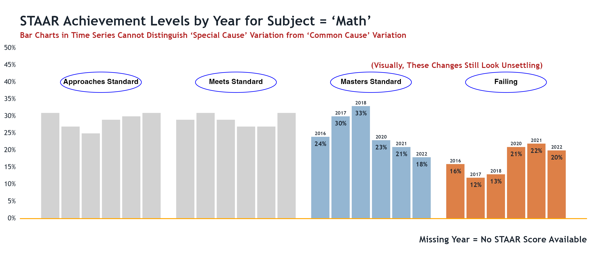

Fig:  Data that is not grouped together taken from 5 TEA "Snapshot" description-only reports and 1 TAPR description-only report

<br>
\bigskip

::: {.callout-warning}

I know from training and long experience that it is dangerous to rely solely on visual inspection of data that is simply displayed and not analyzed.

:::

<br>
\vspace{0.3in}


The XmR charts tell us a very different story.

<br>

 
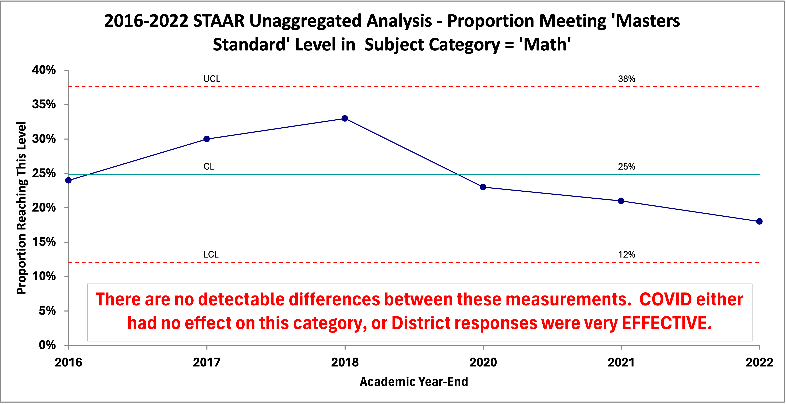

Fig:  Data taken from 5 TEA "Snapshot" description-only reports and 1 TAPR description-only report


<br>
\vspace{0.3in}

And, here's one TEA does not provide us that school boards would likely be keenly interested in -- the 'FAILING' column:
<br>
<br>

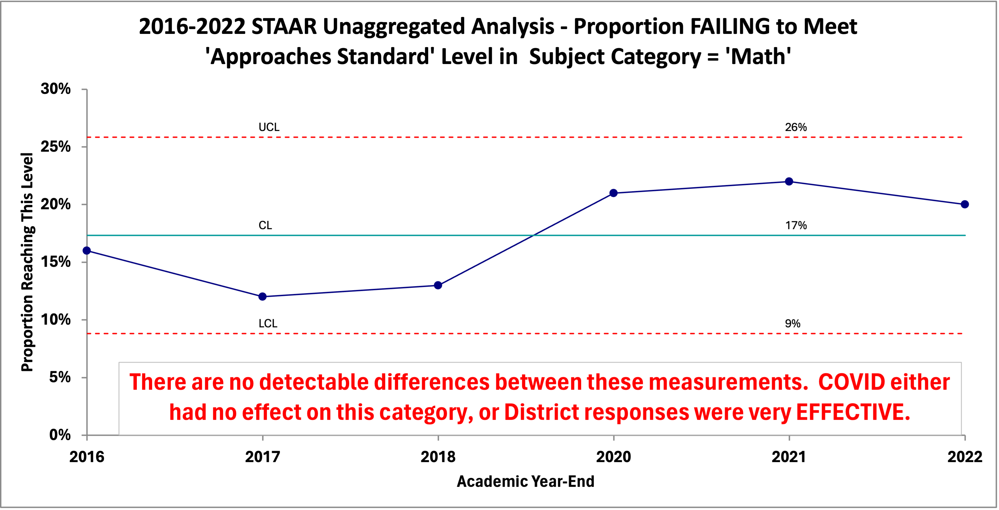

Fig:  Data taken from 5 TEA "Snapshot" description-only reports and 1 TAPR description-only report


<br>
\vspace{0.3in}

The following additional reports (XmR charts) use ungrouped data and includes the necessary information to help us.  Again, they cover public STAAR data provided by TEA, along with a brief interpretation of the charts taken as a whole.  They provide a baseline (context) for evaluating both past and future performance in these additional categories and levels.

<br>
\vspace{0.3in}
 
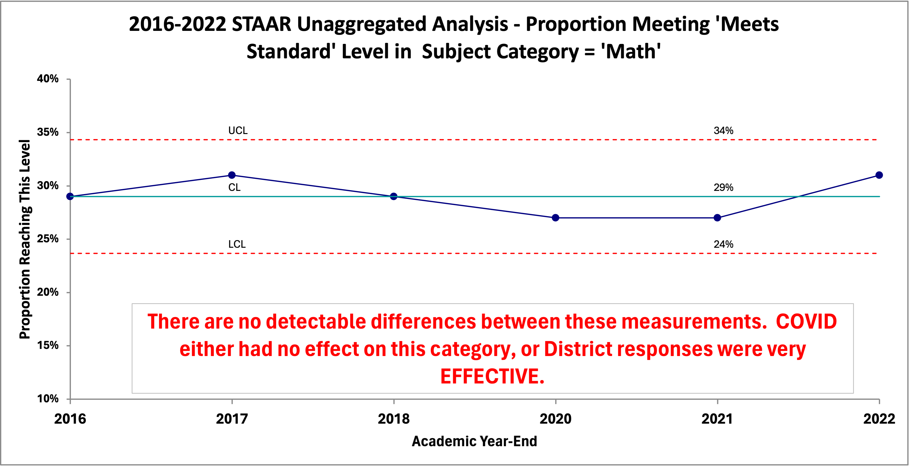

Fig:  Data taken from 5 TEA "Snapshot" description-only reports and 1 TAPR description-only report


\vspace{0.3in}

## INTERPRETING THE CHARTS  


* The measurements do go up and down, but ***there is no evidence that the movements are more than random variation***.  The ups and downs are almost certainly due to the many random forces acting on the cause system that produced the results.  All display ***common cause variation*** because the forces creating the ups and downs are common to all the results we see.


* In this case, the charts show that all measurements fall between the calculated Upper Limit (UCL) and Lower Limit (LCL), with no statistical trends identified.  Accordingly, the processes are ***stable***, with a ***predictable output capability***.  Of the many forces influencing the results, no one of them is predominant.  If one force (or a small combination) was predominate the chart would reveal it.


* If the process remains fundamentally the same, ***the proportion of students in the district taking the STAAR exam in Math that reach the level of 'Meets Grade Level Standard, Masters Grade Level Standard, or Failed to Reach Approaches Grade Level Standard' will continue to fluctuate between their respective upper and lower control limits (UCL and LCL).  Their averages are the best estimated of performance in the future.***.  


* Any expectation of results outside those limits, without a significant change to the system, ***would not be justified - at all***.  


* Any future result, if it falls inside the calculated boundaries ***does not signify an increase or decrease in the performance of the process.*** The routine 'ups' or 'downs' do not mean we are doing better, or worse.


* Confidence in the interpretation will **increase** as you add more data to the chart.  For example, it would be helpful to add years prior to 2016 to see if our interpretation of the data changed.


* This charts includes all the information this data can reveal.  ***If you need or want more information you have to collect more data***.

<br>

::: {.callout-tip appearance="minimal}

## ***Technical Note For the Statistically Curious:***  

The calculated limits are NOT set at 3 standard deviations above and below the average.  The various statistical tests you learned in Statistics 101 cannot help you when your attention is focused on the future output of your district, campus, or pedagogy. They were designed to characterize a population as it exists at a single moment in time - how much or how many; without regard to why the population came to be the way that it is. Even the forecasting techniques are inappropriate for the task at hand.

:::

<br>
<br>

\vspace{0.3in}

# **LEADERSHIP REACTION**


The content of your reports matter.  The appropriate reaction of management (which includes the school board) is ***completely different*** if the system or process indicates a ***stable state*** (predictable) than when it shows evidence of being in an ***unstable state*** (statistically speaking, of course). 


Changing a stable process in reaction to so-called performance indicators (KPIs) that fall within the 'normal' range of a predictable process is ***harmful.***  It makes things ***worse***; no matter how emotional you may become if you think you see things 'going in the wrong direction.'


Reacting to indicators falling outside the identified 'normal' range is ***productive***.  If the indicator is in the 'good' direction efforts to identify the causes and duplicate them are almost always successful.  If they fall in the 'bad' direction, efforts to identify the causes and remove them are worthwhile.


***If your reports are 'description-only' you cannot possibly determine the most appropriate action for the circumstances.***  


<br>

::: {.callout-warning}

## ***Cautionary Note:***  

Districts should cease dependence on recommendations for action based on outside observational studies relying solely on correlations deemed "statistically significant".  This so-called "evidence based" research is not based on generally accepted "cause and effect" experimental design.  Despite the obligatory disclaimers, calls for action often imply "cause and effect" relationships.[^5]

Remember, theories of a flat earth were "evidence based", as are most stereotypes.  The strength and quality of the evidence is more important than whether there is any evidence at all. It is far better to see what works in your district through the use of these methods and your own efforts.

:::

[^5]:  See for instance https://scholarworks.umt.edu/etd/1387/

<br>
\vspace{0.3in}


Should we do nothing when we think we need a change?  ***ABSOLUTELY NOT!***  However, **WHAT** we do and **HOW** we do it is very different under each condition.  Those who simply want 'change', without regard to whether or not the process is in a stable state, will nearly always make things worse.
<br>
<br>

\vspace{0.3in}

# **MAKE A DIFFERENCE, STARTING WHERE YOU ARE**


*  We do not have to wait for TEA to begin providing data in the form we need it.  We don't have to wait for TASB to offer training in the appropriate tools and methods to extract the new information we need for improvement.  


*  It is ridiculously easy to plot dots in time order on a piece of paper and draw lines between the dots.  Sally in fourth grade can do it.  It takes very little training to learn how to construct and use an XmR chart. 

***Here's a screenshot of a run chart made by 4th graders in Leander ISD with newsprint and acrylic paint (and they can explain what it means, too).***

\vspace{0.3in}

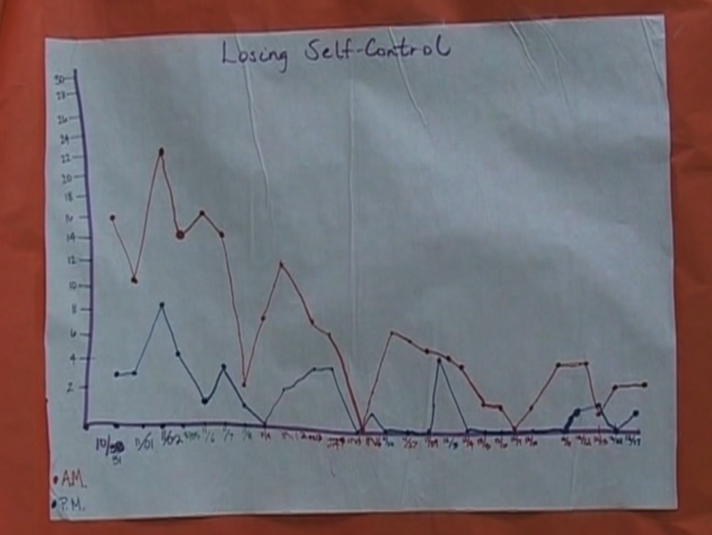

<br>
\vspace{0.3in}

When people in the organization begin 'plotting the dots' amazing ideas and insights bubble up from the people closest to the action - where it is most valuable.  


*  You don't need to wait years to gather high-quality 'baseline' data.  In the real world data is never pristine.  Use what you have now and improve future data collection as you go.  You should strive to get as much data as possible but a valid analysis can be done with as few as 6 data points (the ideal is 25 points, or more).


*  You don't have to have 'everybody on board' to begin.  Every district, department, function, and classroom generates data every day that can be used to help answer the big, important questions.  Those interested in such questions can start now.  Here are some examples:

<br>
\vspace{0.3in}


## **SCHOOL BOARDS**

Metrics and goals defined in strategic plans, district improvement plans, TEA scoring targets, safety and other district-level initiatives can and should be assessed and evaluated with the aid of the new information provided by an XmR chart.  Even financial information can be analyzed this way.

\vspace{0.3in}

## **SUPERINTENDENTS & ADMINISTRATORS**

Legacy programs and efforts to introduce new programs aimed at improvement are all perfect candidates for this simple new chart. Insight into campus-level issues (good and bad) are best analyzed with the new information.  Insight gathered this way helps answer questions like, "Is this initiative or program producing the results we want?"

\vspace{0.3in}

## **CLASSROOMS**

Classroom attendance, MAP scores, disciplinary events, new pedagogues, can be assessed with the aid of the new information.  Anything a teacher may be concerned about can quickly and easily be tracked and analyzed.


\vspace{0.3in}

## **FUNCTIONAL AREAS**

Facilities managers, bus drivers, custodians can ask and answer questions such as:


* Are our initiatives to reduce utility costs working?  By how much?  At which campuses?

* Are late-arrivals decreasing?  Are disciplinary actions during travel increasing?

* Can we reduce supply costs without compromising quality?  How frequently should restrooms be re-stocked?  At which campuses?
<br>
<br>

\vspace{0.3in}

# **SUMMARY**


To go from monitoring a system to improving a system we must move from a 'snapshot' point of view to an 'analysis' point of view.  ***They are two different jobs and require different theory, tools and methods.***  That means the data we use for improvement must include the context of time order, an estimate of future performance, and a range of values we can think of as 'normal' variation.
<br>


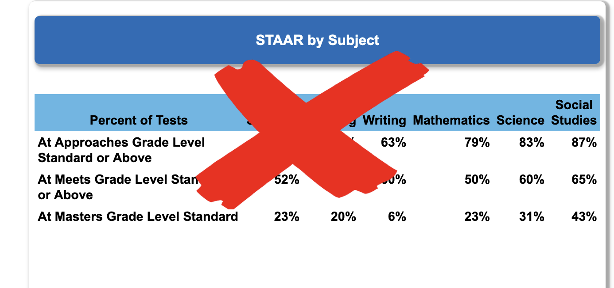

Fig:  This "description-only" form of report cannot help us to improve

<br>
\vspace{0.3in}

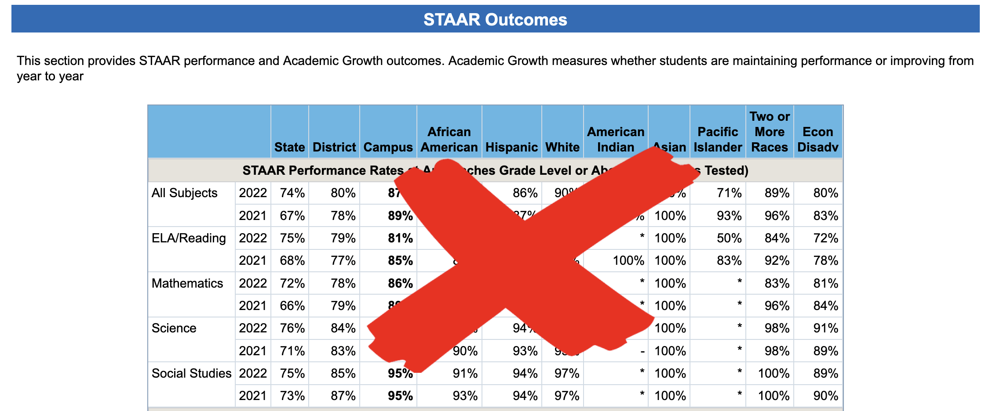

Fig:  This "description-only" form of report cannot help us to improve


<br>

\vspace{0.3in}


The crucial information for analysis of district output capability (and the prediction of future performance) is contained in the order of occurrence found in the time-period-by-time-period data.  ***The more periods included in the analysis, the stronger the evidence for your inferences from the charts.***  


Management in all forms is prediction.  Therefore, management should ***use analytic reports*** instead of ***'description-only'*** reports.  Management should focus on improvement of processes for future results, not solely on judgment of past results. 


