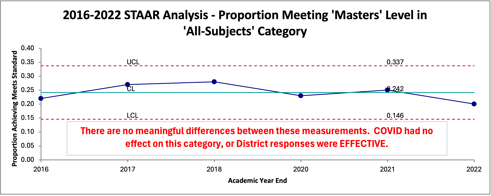

\Large


```{r options, echo=FALSE, error=FALSE, warning=FALSE, message=FALSE}
library(knitr)
opts_chunk$set(echo = FALSE, error = FALSE, warning = FALSE, messages = FALSE, cache = TRUE)

```

```{r source file of basic plots}
# source("STAAR Scores 2016-2022 ggplot.R")

```

```{r load-libraries, echo=FALSE, error=FALSE, warning=FALSE, message=FALSE}

library(knitr)
opts_chunk$set(echo = FALSE, error = FALSE, warning = FALSE, messages = FALSE, cache = TRUE)

# load libraries


library(readxl)
library(writexl) 
library(ggplot2) 
library(tibble) 
library(tidyr) 
library(readr) 
library(purrr) 
library(dplyr) 
library(stringr) 
library(forcats) 
library(lubridate) 
library(janitor) 
library(scales) 
library(ggtext) 
library(paletteer) 
library(viridis) 
library(RColorBrewer)
library(wesanderson) 
library(dutchmasters) 
library(gghighlight)
library(monochromeR)
library(ggforce)

```

```{r, echo=FALSE, eval=knitr::is_html_output(), results='asis'}
# HTML output

cat('
<blockquote class="my-quote">
  <p><strong>"He who has a why to live for can bear almost any how."</strong></p>
  <p class="quote-author">          — Friedrich Nietzsche</p>
  <p class="quote-description">(Twilight of the Idols)</p>
</blockquote>
')

```


```{r, echo=FALSE, eval=knitr::is_latex_output(), results='asis'}

# PDF quote code (LaTeX)
cat('
\\begin{quote}
    \\textbf{"He who has a why to live for can bear almost any how."} \\\\
    \\emph{— Friedrich Nietzsche} \\\\
    (Twilight of the Idols)
\\end{quote}
')

```

\vspace{0.5in}


My aim here is to contribute something to the improvement of learning in our school district; or any school district.  My basic supposition is that Boards of Trustees will welcome information designed to help them create rational policy action aimed at improving future learning in their district.

\bigskip

<br>


**BACKGROUND**

\medskip

All school boards and superintendents work hard to 'keep the lights on' and improve learning in their districts and campuses (or 'campi' if you prefer the Latin form, because it ***is*** funnier).  


Most school boards and superintendents understand by experience and training that it is learning that they hope to improve, not standardized scores.  We know by now that standardized scores can increase while the quality of learning actually decreases.  Despite that knowledge it is often quite difficult to resist reacting to any differences in results as if they constitute a 'trend' or a 'signal'.  Ratings and rankings of our districts and schools by the Texas Education Agency (TEA), under the auspices of the state legislature (or anyone else for that matter), is no different.


The TEA collects data from every school in Texas, performs various calculations, and produces reams of reports and tables summarizing their results by academic year.  These reports consist primarily of calculations mandated by the state legislature, including those designed to allow districts to fulfill their public notification requirements.  

\medskip

These statistical summaries are available to the public and the school districts.  Unfortunately for the public and the school districts, the information is not nearly as helpful as it could be.  In fact, it takes so much 'data wrangling' to put it into a form that is remotely helpful for assessing and improving district and campus learning that it is simply not done.


Instead, administrators and school boards stare at endless rows and columns of mind-numbing data fragments that are 'sliced and diced' to an extent that even [\textcolor{blue}{\url{Ron Popeil}}](https://en.wikipedia.org/wiki/Ron_Popeil) [the inventor of the Chop-O-Matic](https://en.wikipedia.org/wiki/Ron_Popeil) would be envious!  

  
Here's a partial example from a TEA report called a 'Snapshot':
<br>

\medskip

```{r, echo=FALSE, eval=knitr::is_html_output(), results='asis'}
# HTML output

cat('
<figure>
   
  <figcaption>Fig:  Small sample from TEAs Snapshot report</figcaption>
</figure>

<br>
')

```


```{r, echo=FALSE, eval=knitr::is_latex_output(), results='asis'}

# PDF code (LaTeX)
cat('
\\begin{figure}[H] 
  \\centering
  \\includegraphics[width = 1.0\\textwidth, height = 3.0in]{staar-snapshot-example-2021-2022.png}
  \\caption{Small sample from TEAs Snapshot report}
\\end{figure}

\\medskip

')
  

```

\medskip

The entire report can be found here:  
[\textcolor{blue}{\url{PDF}}](https://rptsvr1.tea.texas.gov/cgi/sas/broker?_service=marykay&_program=perfrept.perfmast.sas&_debug=0&ccyy=2022&lev=D&id=094902&prgopt=reports%2Fsnapshot%2Fsnapshot.sas) 

[(HTML)](https://rptsvr1.tea.texas.gov/cgi/sas/broker?_service=marykay&_program=perfrept.perfmast.sas&_debug=0&ccyy=2022&lev=D&id=094902&prgopt=reports%2Fsnapshot%2Fsnapshot.sas)

\bigskip

<br>
And, here's a partial example from a TEA report called a 'School Report Card':

<br>

\medskip

```{r, echo=FALSE, eval=knitr::is_html_output(), results='asis'}
# HTML output

cat('
<figure>
  
  <figcaption>Fig:  Small sample from TEAs School Report Card report</figcaption>
</figure>

<br>
')

```


```{r, echo=FALSE, eval=knitr::is_latex_output(), results='asis'}

# PDF code (LaTeX)
cat('
\\begin{figure}[H]  
  \\centering
  \\includegraphics[width = 1.0\\textwidth, height = 4.0in]{staar-src-example-2021-2022.png}
  \\caption{Small sample from TEAs School Report Card}
\\end{figure}
  

\\medskip

')
  

```

<br>


The entire report can be found here:  
[\textcolor{blue}{\url{PDF}}](https://rptsvr1.tea.texas.gov/cgi/sas/broker?_service=marykay&_program=perfrept.perfmast.sas&_debug=0&ccyy=2022&lev=C&prgopt=reports/src/src.sas&id=094902003) 

[(HTML)](https://rptsvr1.tea.texas.gov/cgi/sas/broker?_service=marykay&_program=perfrept.perfmast.sas&_debug=0&ccyy=2022&lev=C&prgopt=reports/src/src.sas&id=094902003)

  
\bigskip
  
<br>
  
  
**THE PROBLEMS** 
  
So, what is a school district to make of these mountains of aggregated numbers?  Do they help districts improve learning in the future?  In their present form, the answer is a resounding "NO!"  


The 'Snapshot' offered by the TEA is a good example.  My hat is off to their programmers.  It is an impressive compilation of statistics all in one place.  It is well-suited for the needs of the TEA and their reporting responsibilities to the legislature; but completely ill-suited for helping the concerned school board, superintendent, or even tax-paying citizen make an analysis aimed at improving future learning.  One might call it a triumph of computation over value.  
<br>


Why, then, are they 'ill-suited' for district improvement efforts?  


***First***, many of the TEA categories are highly aggregated combinations of similar categories.  This permits TEA to render abstract judgements about a district or campus.  One such judgement is called an "Accountability Rating".  It is well and truly from the '30,000 foot level'.  This lack of specificity renders these reports unsuitable for understanding any particular categories or levels your board may be interested in monitoring or improving.


By analogy, it's like trying to repair your car by reading the overall repair records of similar models.  What you need is diagnostic data about what is happening (or not happening) with your **specific** vehicle.  


Here is an example of aggregated STAAR categories in a TEA report:  


```{r, echo=FALSE, eval=knitr::is_html_output(), results='asis'}
# HTML output

cat('
<figure>
  
  <figcaption>Fig:  The first two rows contain more than one achievement level</figcaption>
</figure>

<br>
')

```


```{r, echo=FALSE, eval=knitr::is_latex_output(), results='asis'}

# PDF code (LaTeX)
cat('
\\begin{figure}[H]  
  \\centering
  \\includegraphics[width = 1.0\\textwidth, height = 3.0in]{staar-snapshot-by-subj-2022-2023-annot.png}
  \\caption{The first two rows contain more than one achievement level}
\\end{figure}

  

\\medskip

')
  

```


<br>

\bigskip

***Second***, the TEA reports are siloed by academic year making it nearly impossible to create a time-period-by-time-period data frame of any categories or levels the board may wish to analyze.  In fact, without time-period-by-time-period data ***no meaningful analysis is possible.***
<br>
<br>

\bigskip

**ANALYSIS - WHAT IS IT?**  

\medskip


In this context analysis means to subject the data to a very simple statistical test to see if the system (or process) producing the data shows evidence of being in a stable state, with a predictable capability.  If stable, this capability will show a range of values that constitute 'normal' for the process until the process itself changes.  Note that interest is on ***the system (or process) that will produce the future output***; not the output of the past.  
<br>

\medskip


```{r, results='asis', echo=FALSE}
if (knitr::is_html_output()) {
cat('<div style="border: 4px solid blue; padding: 10px; border-radius: 10px;">')
cat('<p>Note: The various statistical tests you learned in Statistics 101 cannot help you when your attention is focused on the future output of your district, campus, or pedagogy. They were designed to characterize a population as it exists at a single moment in time - how much or how many; without regard to how or why the population came to be the way that it is. Even the forecasting techniques are inappropriate for the task at hand.</p>')
cat('</div>')
} else if (knitr::is_latex_output()) {
  cat('\\begin{tcolorbox}[colback=white, colframe=blue, boxrule=2pt, arc=4pt]')
  cat('Note:  The various statistical tests you learned in Statistics 101 cannot help you when your attention is focused on the future output of your system.  They were designed to characterize a population as it exists at a single moment in time - how much or how many; without regard to how or why the population came to be the way that it is.  Even the forecasting techniques are overkill for the task at hand.')
  cat('\\end{tcolorbox}')
}

```


<br>

\medskip

The proper reaction of management (which includes the school board) is completely different if the system or process indicates a stable state (predictable) than when it shows signals of being unstable (statistically speaking, of course). 


Reacting to so-called performance indicators that fall within the 'normal' range of a predictable process is harmful.  It makes things worse; no matter how emotional it may be when you think you see things 'going in the wrong direction.'


Reacting to indicators falling outside the identified 'normal' range is productive.  If the indicator is in the 'good' direction efforts to identify the causes and duplicate them are almost always successful.  If they fall in the 'bad' direction, efforts to identify the causes and remove them are worthwhile.


All data I've seen so far as a board member are descriptive only, with no analysis present.  The most important step, analysis, is missing.
<br>


After an embarrasing amount of time spent 'data wrangling' I was able to construct from the 5 available TEA 'Snapshot' reports a small time-period-by-time-period data frame for STAAR scores for all subject-matter categories at the district-level for the academic years ended 2016-2022.  (No STAAR scores were available for the 2019 academic year.)
<br>

\medskip


The TEA STARR Data Divided Into Constituent Parts for the subject 'Math'


|  Year  | Approaches | Mts Std | Masters |Combined | Failed |
| :----: | :--------: | :-----: | :-----: |:------: |:-----: |
|  2016  |       31%  |  29%    |  24%    | 84%     |  16%   |
|  2017  |       27%  |  31%    |  30%    | 88%     |  12%   |
|  2018  |       25%  |  29%    |  33%    | 87%     |  13%   |
|  2020  |       29%  |  27%    |  23%    | 79%     |  21%   |
|  2021  |       30%  |  27%    |  21%    | 78%     |  22%   |
|  2022  |       31%  |  31%    |  18%    | 80%     |  20%   |
: Subject = Math, with Proportions Broken Into Constituent Parts.


Here we see a comprehensive view of all subject categories for the compound level of achievement called 'Meets Grade Level Standard **AND ABOVE**' for all years in the sample:


```{r, echo=FALSE, eval=knitr::is_html_output(), results='asis'}
# HTML output

cat('
<figure>
  
  <figcaption>Fig:  IS THIS A BUSY GRAPH, OR WHAT!?  Still, take a moment to read it.</figcaption>
</figure>

<br>
')

```


```{r, echo=FALSE, eval=knitr::is_latex_output(), results='asis'}

# PDF code (LaTeX)
cat('
\\begin{figure}[H]  
  \\centering
  \\includegraphics[width=1.0\\textwidth, height=5.0in]{staar-combo-level-mts-6-subj-2016-2022-annot.png}
  \\caption{IS THIS A BUSY GRAPH, OR WHAT!?  Still, take a moment to read it.}
\\end{figure}


\\medskip

')
  

```


<br>

\bigskip


**A SOLUTION**

To improve we must move from a 'snapshot' point of view to an 'analysis' point of view.  ***There is no in-between.***  That means the data we seek must include the context of time.  All improvement work requires time-period-by-time-period data.  


The crucial information for analysis of process and system capability, and the prediction of future performance, is contained in the time-period-by-time-period order.  The more periods included in the analysis, the stronger the evidence for your inferences.  


Humans naturally seek context.  That is where notions such as 'this month vs last month vs YTD vs a year ago this month' arose.  Those are insufficient for analysis, but they soothe our need for context of some sort.


Analysis, on the other hand, allows us to answer the important questions:

*  These numbers vary from period to period.  Does that tell us anything important?

*  Are the differences due to random fluctuations or some strong influence now present in our system?

*  Do these different numbers constitute a trend (good, or bad)?

*  The legislature (via the TEA) declares that certain average STAAR scores 'meet requirements.'  What is the **demonstrated** capability of our district to deliver those STAAR scores?  In other words, what is rational to expect from our system in the future?

*  Should we continue this approach, abandon it, or continue it with some tweaks?  Like all bureaucracies, school districts often find that practices, policies and procedures are seldom abandoned.  They just become 'the way we do it here.'


Here is an example of what analysis of some STAAR data looks like:

\begin{figure}[H]  
  \centering
  \includegraphics[width = 1.0\textwidth, height = 3.0in]{xmr-2016-2022-all-subj-masters-only.png}
  \caption{This presentation contains all the information the data can reveal***}
\end{figure}





<br>


  
Managing a district consists of budgeting,  administration, and resource allocation.  Essential, to be sure.  

Budgeting is based on (hopefully) very careful calculations of estimated revenue and expenses expected for the next academic year.  Resource allocation within and between budget categories are determined by the priorities and risk tolerance of the Board of Trustees.  

Resources for facility expansion and improvement depend on both the demographics of the district and the vision of the Executive team.
  
  
District improvement is a totally different exercise.  To improve, boards must be able to assess the demonstrated capability and effectiveness of learning in their district.  .
  
  
  
  
The context of **TIME** is crucial to assess the capability and effectiveness of any system or process, including learning.  

Nearly every district has a 'reputation' (for better or worse) in the region, state, or nation.  Some districts have reputations for great athletic programs, some for music/arts, some for academics.  Those reputations are built over time.


STAAR scoring by subject matter (from the 2022-2023 Snapshot)  To view entire report from pdf format click here:   [\textcolor{blue}{\url{pdf}}](https://rptsvr1.tea.texas.gov/cgi/sas/broker?_service=marykay&_program=perfrept.perfmast.sas&_debug=0&ccyy=2022&lev=D&id=094902&prgopt=reports%2Fsnapshot%2Fsnapshot.sas)
<br>
To view entire report from html format click here:  
[(html)](https://rptsvr1.tea.texas.gov/cgi/sas/broker?_service=marykay&_program=perfrept.perfmast.sas&_debug=0&ccyy=2022&lev=D&id=094902&prgopt=reports%2Fsnapshot%2Fsnapshot.sas)
<br>

\begin{figure}[H]  
  \centering
  \includegraphics[width = 1.0\textwidth, height = 3.0in]{staar-snapshot-by-subj-2022-2023-annot.png}
  \caption{This is a caption for the image.}
\end{figure}


<br>
The section reporting STAAR scoring by ethnicity:

\begin{figure}[H]  
  \centering
  \includegraphics[width = 2.0\textwidth, height = 3.0in]{staar-snapshot-by-ethnicity-2022-2023-annot.png}
  \caption{This is a caption for the image.}
\end{figure}


School boards deal with two types data:

* Enumerative:  quantitative information limited to a description of the past, usually for compliance purposes.

* Analytic:  data subjected to analysis for estimating a causal explanation of phenomena observed in the past, with the aim of improvement in the future.


The aim of a TEA report is descriptive.  How many or how much.  They are estimates of how many people belong to this or that category for a specified academic year.  Or, to report the financial aspects of operations during the school year.  Their aim is NOT to find out WHY there are so many or so few in this or that category: merely how many.  


School boards should look to take action on the district-level processes, or cause-system, that produced the data described in the TEA reports, the aim being to improve learning in the future.  Interest centers on future learning, not the learning of the past.   For example : adopt Policy B over A, or hold on to Policy A, or continue the study of Policy B.

Enumerative study:  A statistical study in which action will be taken on the material in the frame being studied.

Analytic study: A statistical study in which action will be taken on the process or cause-system that produced the frame being studied. The aim being to improve practice in the future.


In other words, an enumerative study is a statistical study in which the focus is on judgment of results, and an analytic study is one in which the focus is on improvement of the process or system which created the results being evaluated and which will continue creating results in the future. A statistical study can be enumerative or analytic, but it cannot be both.


Statistical theory in enumerative studies is used to describe the precision of estimates and the validity of hypotheses for the population studied. In analytical studies, the standard error of a statistic does not address the most important source of uncertainty, namely, the change in study conditions in the future. 


Deming's philosophy is that management should be analytic instead of enumerative. In other words, management should focus on improvement of processes for the future instead of on judgment of current results. 


That 27% must in part depend on chance. If we imagine a set of constant conditions, Statistics and Reality (draft) Page 2 Nov 21, 1998 which would lead on average to 100 murders, we can, on the simplest mathematical model, expect the number we actually see to be anything between 70 and 130.


If there were 130 murders one year, and 70 the next, many people would think that there had been a great improvement: but this could be just chance.  So the first question we could ask is, “Could the 27% reduction be due to chance?”


That is the least of our problems. The murders may be related, as in a war between drug barons. If so, the model is wrong, since it assumes that murders are independent. Or the methods of counting might have changed from one year to the next (are you counting all suspicious deaths, or only cases solved?). Without knowing about such things we cannot predict from these figures to what will
happen next year. So if we want to draw the conclusion that the 27% reduction is a “real” one, that is, one which will continue in the future, we must use knowledge about the problem that is not given by those figures alone.  Even less can we predict accurately what would happen in a different city, or a different country.  The causes of crime, or the effect of a change in policing methods, may be completely different.

Then your actions on the basis of the information available become much more effective. Even more, your actions to get more information improve, because when you understand the sources of uncertainty, you understand how to reduce it.


It seems that it might help if we could look at, say, six years of the 'All Subjects' category at one time.

Well, here it is:

<!-- \begin{figure}[H]  -->
<!--   \centering -->
 <!-- includegraphics[width = 1.0\textwidth, height = 3.0in]{staar-approaches-or-higher-all-subj-2022-2023.png} -->
<!--   \caption{This is a caption for the image.} -->
<!-- \end{figure} -->


<!--  -->


When it comes to improving the system of education in a district this view of the data has a BIG PROBLEM...it aggregates more than one rating level into a category.  It combines the 'At Approaches' AND the 'At Meets' AND the 'At Masters' rating levels all into one combined total and calls it "At Approaches AND HIGHER Level".


To make that category useful for improvement efforts we have to break it into 3 separate categories so each stands on its own.  Just for fun, I call this dilemma 'the TASB Two-Step' - because it will take at least two additional steps to make the category measurements useful.  Then, those two tedious steps have to be repeated over each of the five remaining subject-matter categories.

Well, there's nothing for it but to get to work.  Here they are, 


See Fig. 1


```{r staar-2016-2022-by-subject-approaches2, fig.width = 7.5, fig.height = 6,echo = FALSE, fig.cap = "Smoke a Head!"}
```


```{r staar-2016-2022-by-subject-approaches3, fig.width = 7.5, fig.height = 6,echo = FALSE, fig.cap = "Chew the Root!"}

```


If we try to look at the data over the last 6 years we still have the problem of the 'TASB Two-Step'!


As a board, we should focus first on the combined results of all subjects tested.  This, purportedly, is the performance of the district taken as a whole:


```{r approaches-all-subjects, fig.width = 7.5, fig.height = 6,echo = FALSE, fig.cap = "Everything All Grouped Together!"}

# Use gghighlight to highlight the first grouping

# staar_2016_2022_by_subject_approaches + 
#   gghighlight(subject == unique(subject)[1], unhighlighted_params = list(fill = "grey", keep_scales = TRUE))

```

<!-- A previous plot shows the relationship between x and y variables Fig:   \@ref(fig:approaches-all-subjects). -->

```{r fig.width = 7.5, fig.height = 6,echo = FALSE, echo = FALSE, fig.cap = "Everything All Grouped Together!"}

# Use gghighlight to highlight the 2nd grouping

# staar_2016_2022_by_subject_approaches + gghighlight(subject == unique(subject)[2], unhighlighted_params = list(fill = "grey", keep_scales = TRUE))

```


<!-- The a previous plot shows the relationship between x and y variables \@ref(fig:approaches-all-subjects). -->


```{r fig.width = 7.5, fig.height = 6,echo = FALSE, echo = FALSE, fig.cap = "Everything All Grouped Together!"}

# Use gghighlight to highlight the 3rd grouping

# staar_2016_2022_by_subject_approaches + gghighlight(subject == unique(subject)[3], unhighlighted_params = list(fill = "grey", keep_scales = TRUE))

```


<!-- A previous plot shows the relationship between x and y variables \@ref(fig:approaches-all-subjects). -->


```{r fig.width = 7.5, fig.height = 6,echo = FALSE, fig.cap = "Everything All Grouped Together!"}

# Use gghighlight to highlight the fourth grouping

# staar_2016_2022_by_subject_approaches + gghighlight(subject == unique(subject)[4], unhighlighted_params = list(fill = "grey", keep_scales = TRUE))

```

```{r fig.width = 7.5, fig.height = 6,echo = FALSE, fig.cap = "Everything All Grouped Together!" }

# Use gghighlight to highlight the fifth grouping

# staar_2016_2022_by_subject_approaches + gghighlight(subject == unique(subject)[5], unhighlighted_params = list(fill = "grey", keep_scales = TRUE))

```


```{r fig.width = 7.5, fig.height = 6,echo = FALSE,}
# Use gghighlight to highlight the sixth grouping

# staar_2016_2022_by_subject_approaches + 
#   gghighlight(subject == unique(subject)[6], unhighlighted_params = list(fill = "grey", keep_scales = TRUE))

```


The next rating category also contains more than one rating level.  It combines the 'At Meets' AND the 'At Masters' into one combined total.


<!-- \includegraphics[width = 1.0\textwidth, height = 3.0in]{tasb-2-step-step-2-meets.pdf} -->
<!--  -->


This rating category is the exception; it contains only one rating level.  It shows ONLY the 'At Masters' level totals.


<!-- \includegraphics[width = 1.0\textwidth]{tasb-2-step-step-3-masters.pdf} -->
<!--  -->


```{r data-wrangling-if-needed}

```


```{r six-trends, fig.width = 7, fig.height = 4, echo = FALSE, fig.cap = "Six Random 'Trends'!"}

# Create the tibble

six_trends <- tibble(
  trend = rep(c("Upward Trend (?)", "Downturn (?)", "Rebound (?)", "Setback (?)", "Turnaround (?)", "Downward Trend (?)"), each = 3),
  y = c(0,1,2,0,2,1,1,0,2,1,2,0,2,0,1,2,1,0),
  x = rep(c(0, 1, 2), 6)
)

# Define a custom color palette with 6 distinct colors
custom_colors <- c("red", "blue", "darkgreen", "purple", "darkorange", "black")


# Create the line plot with facets using the custom color palette
six_trends_facet_plot <- six_trends %>%
  ggplot(aes(x = x, y = y)) +
  geom_line(aes(group = trend, color = trend), linewidth = 2) +
  geom_point(aes(x = x, y = y, group = interaction(trend, y), color = trend), size = 3) +
  facet_wrap(vars(trend)) +
  theme_minimal(base_size = 16) +
  scale_x_continuous(breaks = c(0, 1, 2)) +
  scale_y_continuous(breaks = c(0, 1, 2)) +
  scale_color_manual(values = custom_colors) +
  labs(x = NULL, y = NULL) +   
  theme(legend.position = "",
        strip.text = element_text(color = "black", face = "bold"),
        axis.title.x = element_blank(),  
        axis.title.y = element_blank(),
        axis.text.x = element_blank(), 
        axis.text.y = element_blank(),  
        axis.ticks = element_blank(),  
        panel.grid.major = element_blank(),  
        panel.grid.minor = element_blank(),
        panel.spacing = unit(2.0, "lines")  
        )  

# View the plot
six_trends_facet_plot


```

<br>


