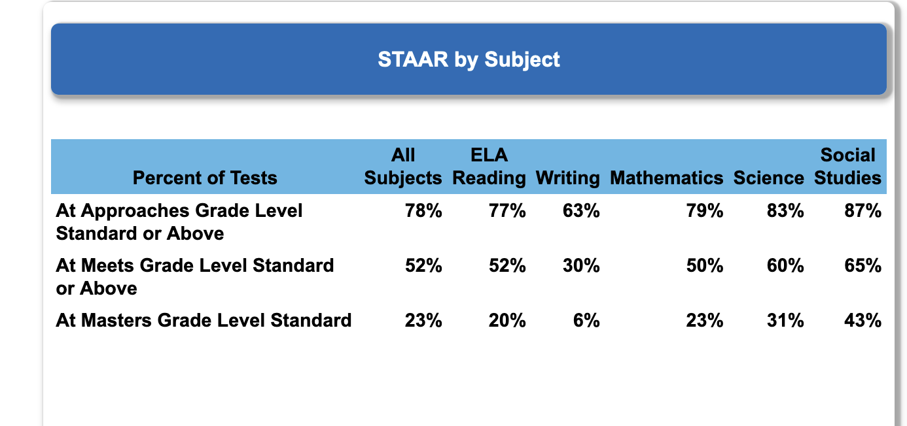
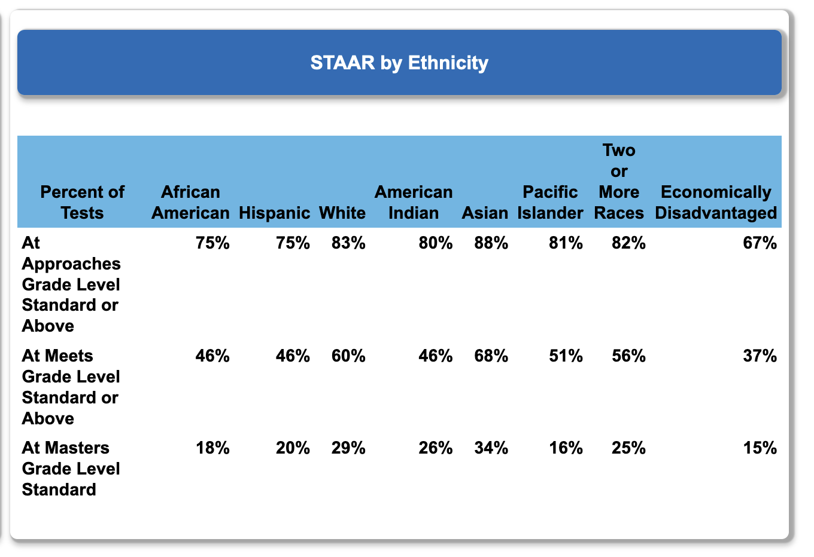

\Large


```{r options, echo=FALSE, error=FALSE, warning=FALSE, message=FALSE}
library(knitr)
opts_chunk$set(echo = FALSE, error = FALSE, warning = FALSE, messages = FALSE, cache = TRUE)

```

```{r source file of basic plots}
# source("STAAR Scores 2016-2022 ggplot.R")

```

```{r load-libraries, echo=FALSE, error=FALSE, warning=FALSE, message=FALSE}

library(knitr)
opts_chunk$set(echo = FALSE, error = FALSE, warning = FALSE, messages = FALSE, cache = TRUE)

# load libraries


library(readxl)
library(writexl) 
library(ggplot2) 
library(tibble) 
library(tidyr) 
library(readr) 
library(purrr) 
library(dplyr) 
library(stringr) 
library(forcats) 
library(lubridate) 
library(janitor) 
library(scales) 
library(ggtext) 
library(paletteer) 
library(viridis) 
library(RColorBrewer)
library(wesanderson) 
library(dutchmasters) 
library(gghighlight)
library(monochromeR)


```

```{r, echo=FALSE, eval=knitr::is_html_output(), results='asis'}
# HTML output

cat('
<blockquote class="my-quote">
  <p><strong>"He who has a why to live for can bear almost any how."</strong></p>
  <p class="quote-author">          — Friedrich Nietzsche</p>
  <p class="quote-description">(Twilight of the Idols)</p>
</blockquote>
')

```


```{r, echo=FALSE, eval=knitr::is_latex_output(), results='asis'}

# PDF output (LaTeX)
cat('
\\begin{quote}
    \\textbf{"He who has a why to live for can bear almost any how."} \\\\
    \\emph{— Friedrich Nietzsche} \\\\
    (Twilight of the Idols)
\\end{quote}
')

```

```{r, echo=FALSE, eval=knitr::is_latex_output(), results='asis'}

# Insert line breaks 
cat(
  '\\'
  )

```

```{r, echo=FALSE, eval=knitr::is_html_output(), results='asis'}

# Insert line breaks 
cat(
  '<br>
  <br>'
  )

```


My aim here is to contribute something to the improvement of learning in our school district; or in any school district.  The basic supposition is that any data considered by the Board of Trustees should be for policy action aimed at improving future learning in the district.
<br>
<br>


BACKGROUND

The Texas Education Agency (TEA) collects data from every school district in Texas, performs calculations, and produces reams of reports and tables of data.  These reports primarily consist of measures required by the state legislature.  For example, one statistic computed is the so-called 'Accountability Rating' for every district in the state.  Each campus also receives a rating.  


The statistical summaries are available to the public and the school districts.  Unfortunately for the public and the school districts, the information is not nearly as helpful as it could be.  In fact, it takes so much 'data wrangling' to put it into a form that is remotely helpful for assessing and improving district and campus performance that it is simply not done.    


Instead, administrators and school boards stare at endless rows and columns of mind-numbing data fragments that are 'sliced and diced' to an extent that even Ron Popeil would be envious.  


So, what is a school district to make of these mountains of numbers?  Do they help the district to improve learning in the future?  In their present form, the answer is a resounding "NO!"  


One of the many reports made available on the TEA website is the 'Snapshot', an impressive compilation of statistics all in one place.  It is well-suited for the needs of the TEA and their reporting responsibilities to the legislature; but ill-suited for helping the concerned school board, superintendent, or tax-paying citizen make policy decisions.  
<br>

STAAR scoring by subject matter (from the 2022-2023 Snapshot)  View the entire report here.
<br>

\includegraphics{tea-staar-snapshot-by-subj-2022-2023.png}



<br>
The section reporting STAAR scoring by ethniticy:

\includegraphics{tea-staar-snapshot-by-ethnicity-2022-2023.png}



School boards deal with two types data:

* Enumerative:  quantitative information limited to a description of the past, usually for compliance purposes.

* Analytic:  data subjected to analysis for estimating a causal explanation of phenomena observed in the past, with the aim of improvement in the future.


TEA produces enumerative data estimating the state of affairs at one point in the past.  The aim of such data collection is to comply with legislative requirements.  The purpose is to take action ON the district; reward or punishment either by the state or the public.


An analytic study focuses on predicting future results of policy actions taken now.  The aim of such data analysis is to take action IN the district.


The aim of a TEA report is descriptive.  How many or how much.  They are estimates of how many people belong to this or that category for a specified academic year.  Or, to report the financial aspects of operations during the school year.  Their aim is NOT to find out WHY there are so many or so few in this or that category: merely how many.  


School boards should look to take action on the district-level proccsses, or cause-system, that produced the data described in the TEA reports, the aim being to improve learning in the future.  Interest centers on future learning, not the learning of the past.   For example : adopt Policy B over A, or hold on to Policy A, or continue the study of Policy B.

Enumerative study:  A statistical study in which action will be taken on the material in the frame being studied.

Analytic study: A statistical study in which action will be taken on the process or cause-system that produced the frame being studied. The aim being to improve practice in the future.


In other words, an enumerative study is a statistical study in which the focus is on judgment of results, and an analytic study is one in which the focus is on improvement of the process or system which created the results being evaluated and which will continue creating results in the future. A statistical study can be enumerative or analytic, but it cannot be both.


Statistical theory in enumerative studies is used to describe the precision of estimates and the validity of hypotheses for the population studied. In analytical studies, the standard error of a statistic does not address the most important source of uncertainty, namely, the change in study conditions in the future. 


Deming's philosophy is that management should be analytic instead of enumerative. In other words, management should focus on improvement of processes for the future instead of on judgment of current results. 


That 27% must in part depend on chance. If we imagine a set of constant conditions, Statistics and Reality (draft) Page 2 Nov 21, 1998 which would lead on average to 100 murders, we can, on the simplest mathematical model, expect the number we actually see to be anything between 70 and 130.

If there were 130 murders one year, and 70 the next, many people would think that there had been a great improvement: but this could be just chance.  So the first question we could ask is, “Could the 27% reduction be due to chance?”


That is the least of our problems. The murders may be related, as in a war between drug barons. If so, the model is wrong, since it assumes that murders are independent. Or the methods of counting might have changed from one year to the next (are you counting all suspicious deaths, or only cases solved?). Without knowing about such things we cannot predict from these figures to what will
happen next year. So if we want to draw the conclusion that the 27% reduction is a “real” one, that is, one which will continue in the future, we must use knowledge about the problem that is not given by those figures alone.  Even less can we predict accurately what would happen in a different city, or a different country.  The causes of crime, or the effect of a change in policing methods, may be completely different.

Then your actions on the basis of the information available become much more effective. Even more, your actions to get more information improve, because when you understand the sources of uncertainty, you understand how to reduce it.


It seems that it might help if we could look at, say, six years of the 'All Subjects' category at one time.

Well, here it is:

<!-- includegraphics[width = 1.0\textwidth]{tea-staar-approaches-or-higher-all-subj-2022-2023.png} -->

<!--  -->


When it comes to improving the system of education in a district this view of the data has a BIG PROBLEM...it aggregates more than one rating level into a category.  It combines the 'At Approaches' AND the 'At Meets' AND the 'At Masters' rating levels all into one combined total and calls it "At Approaches AND HIGHER Level".


To make that category useful for improvement efforts we have to break it into 3 separate categories so each stands on its own.  Just for fun, I call this dilema 'the TASB Two-Step' - because it will take at least two additional steps to make the category measurements useful.  Then, those two tedious steps have to be repeated over each of the five remaining subject-matter categories.

Well, there's nothing for it but to get to work.  Here they are, 


See Fig. 1


```{r staar-2016-2022-by-subject-approaches2, fig.width = 7.5, fig.height = 6,echo = FALSE, fig.cap = "Smoke a Head!"}
```


```{r staar-2016-2022-by-subject-approaches3, fig.width = 7.5, fig.height = 6,echo = FALSE, fig.cap = "Chew the Root!"}

```


If we try to look at the data over the last 6 years we still have the problem of the 'TASB Two-Step'!


As a board, we should focus first on the combined results of all subjects tested.  This, purportedly, is the performance of the district taken as a whole:


```{r approaches-all-subjects, fig.width = 7.5, fig.height = 6,echo = FALSE, fig.cap = "Everything All Grouped Together!"}

# Use gghighlight to highlight the first grouping

# staar_2016_2022_by_subject_approaches + 
#   gghighlight(subject == unique(subject)[1], unhighlighted_params = list(fill = "grey", keep_scales = TRUE))

```

<!-- A previous plot shows the relationship between x and y variables Fig:   \@ref(fig:approaches-all-subjects). -->

```{r fig.width = 7.5, fig.height = 6,echo = FALSE, echo = FALSE, fig.cap = "Everything All Grouped Together!"}

# Use gghighlight to highlight the 2nd grouping

# staar_2016_2022_by_subject_approaches + gghighlight(subject == unique(subject)[2], unhighlighted_params = list(fill = "grey", keep_scales = TRUE))

```


<!-- The a previous plot shows the relationship between x and y variables \@ref(fig:approaches-all-subjects). -->


```{r fig.width = 7.5, fig.height = 6,echo = FALSE, echo = FALSE, fig.cap = "Everything All Grouped Together!"}

# Use gghighlight to highlight the 3rd grouping

# staar_2016_2022_by_subject_approaches + gghighlight(subject == unique(subject)[3], unhighlighted_params = list(fill = "grey", keep_scales = TRUE))

```


<!-- A previous plot shows the relationship between x and y variables \@ref(fig:approaches-all-subjects). -->


```{r fig.width = 7.5, fig.height = 6,echo = FALSE, fig.cap = "Everything All Grouped Together!"}

# Use gghighlight to highlight the fourth grouping

# taar_2016_2022_by_subject_approaches + gghighlight(subject == unique(subject)[4], unhighlighted_params = list(fill = "grey", keep_scales = TRUE))

```

```{r fig.width = 7.5, fig.height = 6,echo = FALSE, fig.cap = "Everything All Grouped Together!" }

# Use gghighlight to highlight the fifth grouping

# staar_2016_2022_by_subject_approaches + gghighlight(subject == unique(subject)[5], unhighlighted_params = list(fill = "grey", keep_scales = TRUE))

```


```{r fig.width = 7.5, fig.height = 6,echo = FALSE,}
# Use gghighlight to highlight the sixth grouping

# staar_2016_2022_by_subject_approaches + 
#   gghighlight(subject == unique(subject)[6], unhighlighted_params = list(fill = "grey", keep_scales = TRUE))

```


The next rating category also contains more than one rating level.  It combines the 'At Meets' AND the 'At Masters' into one combined total.


<!-- \includegraphics{tasb-2-step-step-2-meets.pdf} -->
<!--  -->


This rating category is the exception; it contains only one rating level.  It shows ONLY the 'At Masters' level totals.


<!-- \includegraphics{tasb-2-step-step-3-masters.pdf} -->
<!--  -->


```{r data-wrangling-if-needed}

```


```{r six-trends, fig.width = 7, fig.height = 4, echo = FALSE, fig.cap = "Six Random 'Trends'!"}

# Create the tibble

six_trends <- tibble(
  trend = rep(c("Upward Trend (?)", "Downturn (?)", "Rebound (?)", "Setback (?)", "Turnaround (?)", "Downward Trend (?)"), each = 3),
  y = c(0,1,2,0,2,1,1,0,2,1,2,0,2,0,1,2,1,0),
  x = rep(c(0, 1, 2), 6)
)

# Define a custom color palette with 6 distinct colors
custom_colors <- c("red", "blue", "darkgreen", "purple", "darkorange", "black")


# Create the line plot with facets using the custom color palette
six_trends_facet_plot <- six_trends %>%
  ggplot(aes(x = x, y = y)) +
  geom_line(aes(group = trend, color = trend), linewidth = 2) +
  geom_point(aes(x = x, y = y, group = interaction(trend, y), color = trend), size = 3) +
  facet_wrap(vars(trend)) +
  theme_minimal(base_size = 16) +
  scale_x_continuous(breaks = c(0, 1, 2)) +
  scale_y_continuous(breaks = c(0, 1, 2)) +
  scale_color_manual(values = custom_colors) +
  labs(x = NULL, y = NULL) +   
  theme(legend.position = "",
        strip.text = element_text(color = "black", face = "bold"),
        axis.title.x = element_blank(),  
        axis.title.y = element_blank(),
        axis.text.x = element_blank(), 
        axis.text.y = element_blank(),  
        axis.ticks = element_blank(),  
        panel.grid.major = element_blank(),  
        panel.grid.minor = element_blank(),
        panel.spacing = unit(2.0, "lines")  
        )  

# View the plot
six_trends_facet_plot


```


